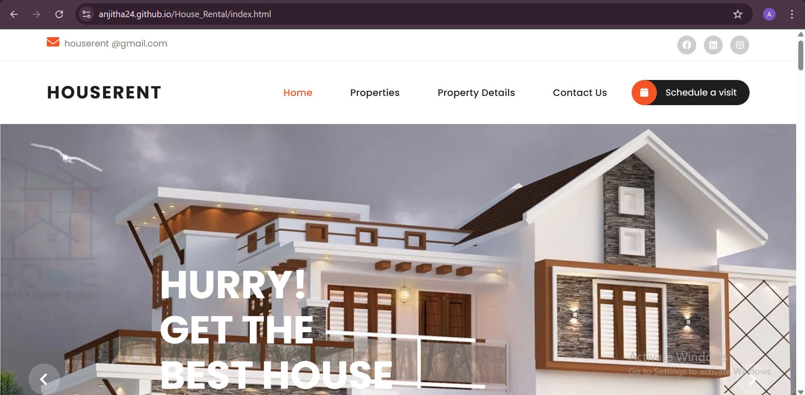
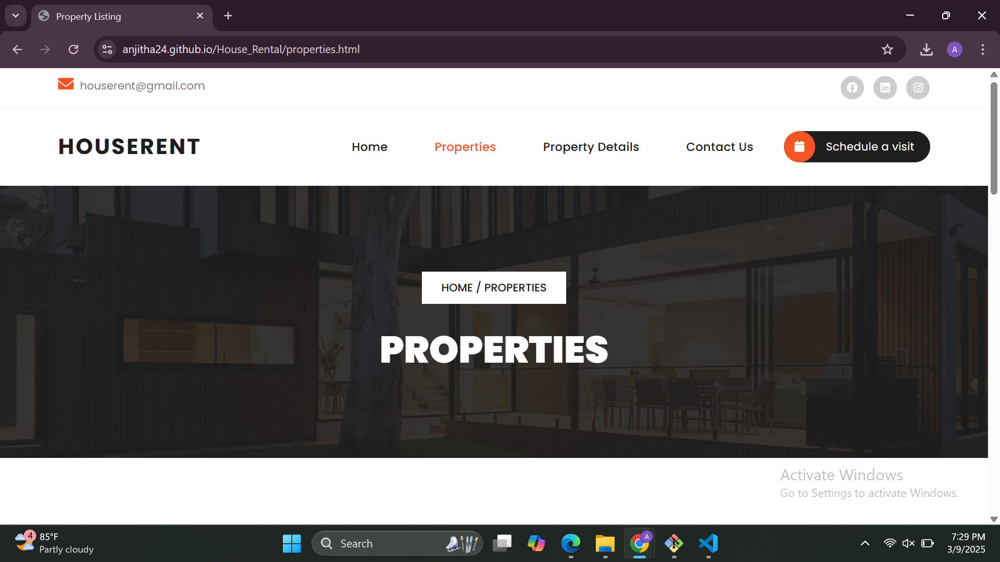
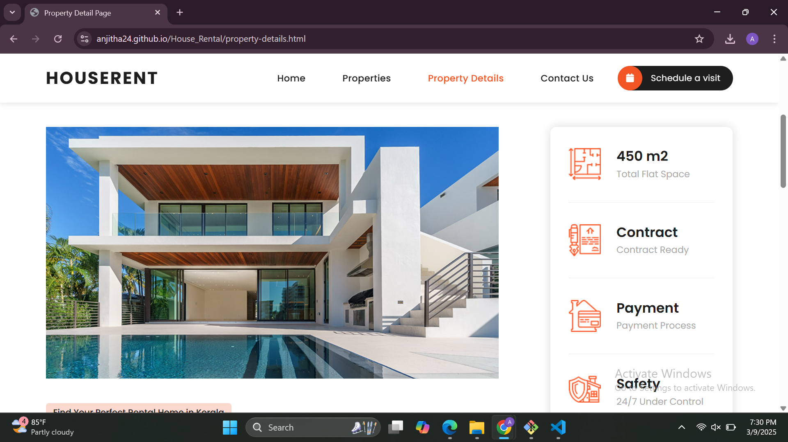

# House Rental Website

## Overview
This project is a **House Rental Website** where users can browse, compare, and rent properties. The site includes property listings, detailed descriptions, images, and a booking system for scheduling visits.

## Contributors
- Anjitha Anil
- Ashwini Anil
- Eunice Freeda.T 

## Features
- Browse available properties (apartments, villas, penthouses)
- View detailed property descriptions with images
- Filter properties based on price, location, and availability
- Schedule property visits
- Responsive design for a seamless user experience

## Technologies Used
- **Frontend:** HTML, CSS, JavaScript, Bootstrap
- **Backend:** (To be added if applicable)
- **Libraries & Plugins:**
  - jQuery
  - Bootstrap
  - FontAwesome
  - Owl Carousel
  - Swiper.js

## Installation
1. Clone the repository:
   ```sh
   git clone https://github.com/yourusername/houserent.git
   ```
2. Navigate to the project folder:
   ```sh
   cd houserent
   ```
3. Open `index.html` in a web browser to view the website.

## File Structure
```
/house-rent
│-- assets/
│   ├── css/        # Stylesheets
│   ├── images/     # Property images
│   ├── js/         # JavaScript files
│-- vendor/
│-- index.html
│-- properties.html
│-- property-details.html
│-- contact.html
│-- README.md
```

## Future Enhancements
- Implement a backend for user authentication and property management
- Add a search and filtering functionality
- Integrate a payment gateway for rental transactions


## Project Screenshots

### Home Page  


### Property Listings  


### Property Details  


## Website Demo Video  
[](assets/images/video.mp4)

> **Note:** Click the thumbnail to watch the website demo video.

---


